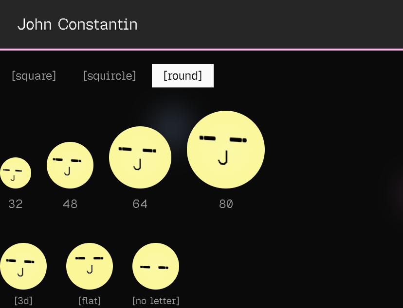
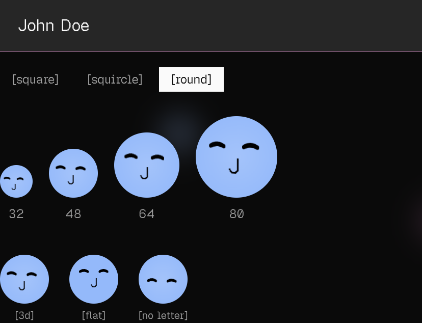
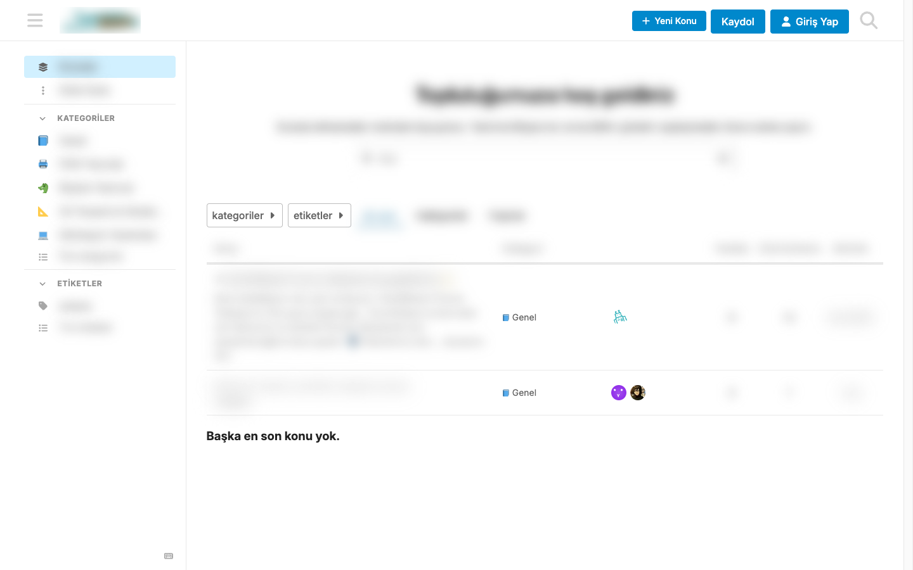
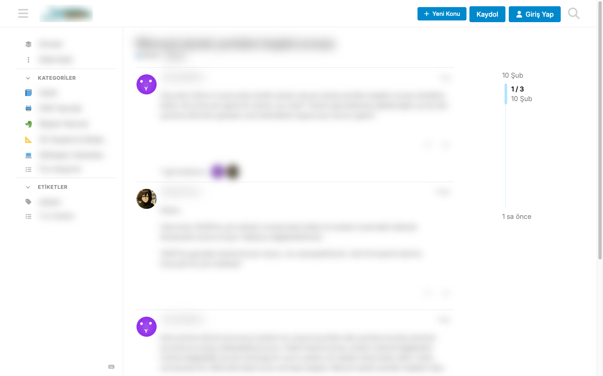

# discourse-facehash-avatars

Facehash-style avatars for Discourse default avatar slots.

This plugin replaces Discourse fallback avatars with deterministic, friendly SVG faces for users who have not uploaded a custom profile image. If a user has uploaded their own avatar, that image stays untouched.

## What Is Facehash?

[Facehash](https://www.facehash.dev/) is an avatar system by cossistant that generates a consistent face from any string input (username, email, UUID, bot ID, etc.). The same input always produces the same face.

Why this style is useful:
- No external avatar service calls.
- No avatar storage pipeline required for fallback images.
- Deterministic output that remains stable across sessions and pages.
- Lightweight SVG output that is easy to cache.

This plugin adapts that concept for Discourse default-avatar behavior.

## Official Links

- Plugin repository: [github.com/devatnull/facehash-discourse](https://github.com/devatnull/facehash-discourse)
- Facehash website: [facehash.dev](https://www.facehash.dev/)
- Upstream package: [npmjs.com/package/facehash](https://www.npmjs.com/package/facehash)
- Meta topic: `TODO` (add after publishing on Meta)
- Changelog: `CHANGELOG.md`

## Quick Example

Facehash React usage from upstream:

```tsx
import { Facehash } from "facehash";

<Facehash name="agent-47" size={48} />;
```

Discourse plugin equivalent behavior:
- Discourse asks for default avatar template URL.
- Plugin serves deterministic SVG from:

```text
/facehash_avatar/:username/:size/:version.svg
```

Example:

```text
/facehash_avatar/yunus.gunes/48/3210236103.svg
```

## Screenshots

Facehash source demos captured from [facehash.dev](https://www.facehash.dev/):




Plugin behavior on Discourse (anonymized):




## Installation

Follow the official Discourse plugin installation guide:
- [meta.discourse.org/t/install-a-plugin/19157](https://meta.discourse.org/t/install-a-plugin/19157)

### Docker Launcher (`app.yml`)

Add the plugin clone command under `hooks -> after_code`:

```yml
hooks:
  after_code:
    - exec:
        cd: $home/plugins
        cmd:
          - git clone https://github.com/devatnull/facehash-discourse.git discourse-facehash-avatars
```

Then rebuild:

```bash
cd /var/discourse
./launcher rebuild app
```

### Docker Compose (custom deployments)

1. Clone the plugin on the host:

```bash
mkdir -p plugins
git clone https://github.com/devatnull/facehash-discourse.git plugins/discourse-facehash-avatars
```

2. Mount it into the Discourse container:

```yml
services:
  discourse:
    volumes:
      - ${DISCOURSE_DATA_PATH}:/shared
      - ./plugins/discourse-facehash-avatars:/var/www/discourse/plugins/discourse-facehash-avatars
```

3. Recreate the Discourse service:

```bash
docker compose --env-file discourse/.env up -d --force-recreate discourse
```

## How To Use

1. Go to `Admin -> Settings`.
2. Search for `facehash_avatars`.
3. Configure your defaults.

## Supported Facehash-Style Features

This plugin currently supports these configurable behaviors:

- Deterministic seed source (`username`, `name`, `name_or_username`)
- Shape (`round`, `squircle`, `square`)
- Variant (`gradient` or `solid`)
- Show/hide initial
- Custom color palette
- Auto foreground contrast or manual foreground color
- Blink animation (global enable + interval + duration)
- Inline overlay rendering for post lists/streams
- Face-level hover effect in inline overlays

Not currently exposed (by design in this plugin):
- React-only APIs such as `onRenderMouth` and component-level `className`
- Upstream `intensity3d` prop
- Upstream `Avatar/AvatarImage/AvatarFallback` wrapper API

## Settings

| Setting | Default | Description |
| --- | --- | --- |
| `facehash_avatars_enabled` | `true` | Enable Facehash avatars for default avatar fallback. |
| `facehash_avatars_gradient_overlay` | `true` | Use gradient style (off = solid style). |
| `facehash_avatars_show_initial` | `true` | Show initial character on avatar. |
| `facehash_avatars_inline_render` | `true` | Enable safe inline Facehash overlay rendering (no DOM node reparenting). |
| `facehash_avatars_hover_effect` | `true` | Enable subtle face-level hover interaction on inline overlays. |
| `facehash_avatars_force_non_center_interactive_tilt` | `true` | If the deterministic pose is center (`0,0`), use a deterministic non-center interactive tilt so hover feedback remains visible. |
| `facehash_avatars_enable_blink` | `false` | Enable deterministic blink animation on face marks. |
| `facehash_avatars_blink_interval_seconds` | `8` | Blink loop interval in seconds (clamped to 2..30). |
| `facehash_avatars_blink_duration_ms` | `140` | Blink close/open duration in milliseconds (clamped to 80..2000). |
| `facehash_avatars_shape` | `round` | Avatar mask shape: `round`, `squircle`, or `square`. |
| `facehash_avatars_font_family` | `FacehashGeistPixel, "Geist Pixel Square", "Geist Pixel", "Geist Mono", ui-monospace, "SFMono-Regular", "Roboto Mono", Menlo, Monaco, "Liberation Mono", "DejaVu Sans Mono", "Courier New", monospace` | Initial text `font-family` used in SVG output. Default uses bundled Geist Pixel (Square) with monospace fallbacks. |
| `facehash_avatars_font_weight` | `600` | Initial text `font-weight` (`100`..`900` or `normal/bold`). |
| `facehash_avatars_auto_foreground_contrast` | `true` | Auto-select black/white foreground for legibility. |
| `facehash_avatars_foreground_color` | `#111827` | Manual foreground color when auto contrast is disabled. |
| `facehash_avatars_hash_source` | `username` | Seed source: `username`, `name`, `name_or_username`. |
| `facehash_avatars_palette` | `#0f766e|#0ea5a4|#2563eb|#4f46e5|#9333ea|#be185d|#ea580c|#ca8a04|#15803d|#334155` | Color palette (pipe/comma/space/newline separated hex values). |

## Behavior

- Route shape: `/facehash_avatar/:username/{size}/:version.svg`
- Bundled font route: `/facehash_avatar/font/GeistPixel-Square.woff2`
- Response type: `image/svg+xml`
- Cache: immutable 1-year cache plus `ETag`
- Uploaded avatars: unchanged
- Determinism: same seed input returns same avatar output

## Security And Validation

- Username parsing/validation is aligned with Discourse `UsernameValidator`.
- Invalid username payloads fall back safely to the core blank avatar image.
- Name-based hash source lookups are cached and invalidated on user updates.
- Inline client renderer avoids destructive DOM reparenting to stay compatible with modern Discourse Glimmer rendering.

## Production Ops

Facehash avatars are generated dynamically and cached aggressively. On instances with strict global request throttling, admin sessions (especially with browser DevTools source maps enabled) can burst enough requests to trigger temporary `429` blocks.

If needed, tune Discourse global limits:

```env
DISCOURSE_MAX_REQS_PER_IP_PER_10_SECONDS=120
DISCOURSE_MAX_REQS_PER_IP_PER_MINUTE=1200
DISCOURSE_MAX_ASSET_REQS_PER_IP_PER_10_SECONDS=1000
DISCOURSE_MAX_REQS_PER_IP_MODE=block
```

Docker Compose note:
- Ensure these variables are present in `.env`.
- Ensure they are also passed in `docker-compose.yml` under `discourse.environment`.

## Testing

Run Ruby specs inside a Discourse checkout:

```bash
bundle exec rspec plugins/discourse-facehash-avatars/spec
```

Run QUnit acceptance tests:

```bash
rake plugin:qunit['discourse-facehash-avatars']
```

## Publishing Checklist

- Meta topic template: `docs/META_TOPIC_TEMPLATE.md`
- Launch checklist: `docs/PUBLISH_CHECKLIST.md`

After publishing on Meta, replace `TODO` in **Official Links** with the live topic URL.

## License

MIT

### Third-party font license

- Geist Pixel (`GeistPixel-Square.woff2`) is bundled under SIL Open Font License 1.1.
- License file: `licenses/third_party/Geist-OFL-1.1.txt`
